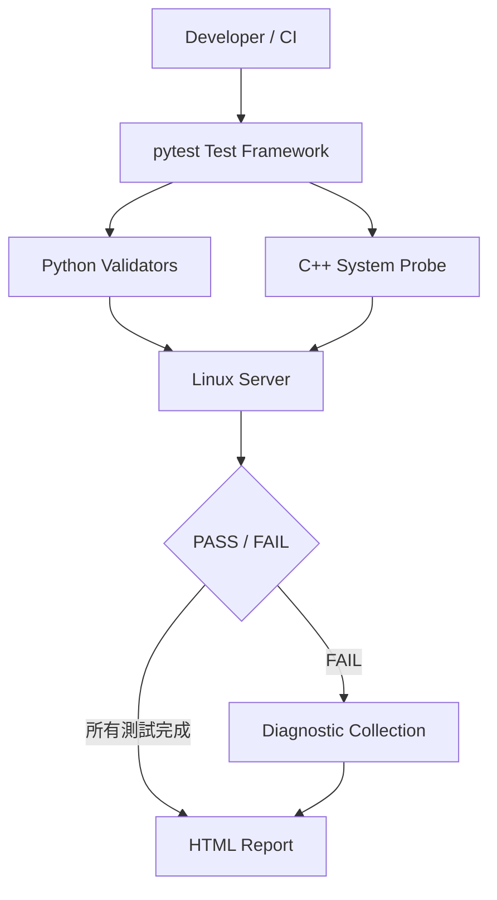

# Linux Server Validation Framework

一個用於展示 Linux Server Firmware / Software Quality Engineer 能力的自動化驗證作品集專案。

這是一個可實際執行的 Linux 伺服器健康檢查與驗證平台：自動檢查主機 CPU、記憶體、磁碟、網路、服務與 OS 資訊；當檢查失敗時，自動保留除錯證據與 HTML 報告。

## 這個專案在做什麼？

想像你需要驗證一台剛安裝完成、準備交付或準備升級 firmware 的 Linux server 是否健康。手動逐一執行 `free`、`df`、`ip addr`、`systemctl` 很容易漏掉資訊，也不方便在 CI 中重複執行。

本專案將這類基本驗證自動化：

1. pytest 執行各項 host validation。
2. Python 讀取系統資源與服務狀態，並和 `config/config.yaml` 的門檻比較。
3. 若結果失敗，framework 自動收集對應的診斷命令輸出，例如 `df -h`、`free -h`、process 清單或 service journal。
4. 結果顯示在 terminal，並輸出成可保存、可交給團隊檢視的 HTML report。
5. C++17 probe 額外直接解析 Linux `/proc`，展示低階 Linux 資訊讀取與跨語言整合能力。

## 展示的能力

- Python 3.10+、type hints、模組化設計與 error handling
- pytest test automation 與 pytest-html reporting
- Linux CPU、memory、disk、network、systemd service validation
- Linux command timeout、command not found、permission denied、non-zero exit code 處理
- fault injection 與 recovery 設計
- failure diagnostics / root-cause analysis workflow
- C++17、CMake、`/proc/cpuinfo`、`/proc/meminfo`、`/proc/loadavg`
- 以 YAML 設定門檻，方便不同測試環境重複使用

## 架構



## 驗證項目

| 項目 | 檢查內容 | 失敗條件 |
| --- | --- | --- |
| CPU | usage、logical core count、load average | CPU usage 超過設定門檻 |
| Memory | total、available、usage percentage | memory usage 超過設定門檻 |
| Disk | total、used、free、usage percentage | 指定路徑使用率超過門檻 |
| Network | 非 loopback interface 是否 UP、目標主機 DNS/TCP connectivity | 沒有可用 interface、解析或連線失敗/逾時 |
| Service | 指定 systemd services，例如 ssh、docker | service 非 active |
| OS | distribution、kernel、hostname、architecture、uptime | 基本系統資訊不可用 |
| C++ probe | `/proc` CPU、memory、load average | probe 無法執行或 JSON 不正確 |

## 專案結構

```text
.
├── config/config.yaml        # 可調整的 threshold、網路與 service 設定
├── framework/                # Python validation、command runner、diagnostics
├── tests/                    # 可單獨執行的 pytest tests
├── fault_injection/          # 明確 opt-in 的安全故障模擬工具
├── cpp_diag/                 # C++17 /proc JSON probe
├── scripts/                  # Linux build 與 test 指令碼
└── reports/                  # HTML report 與失敗診斷輸出
```

## 每個程式在做什麼？

以下是從「執行測試」開始，逐一說明各個檔案如何合作。你可以把整個專案理解成：`tests/` 提出問題、`framework/` 取得答案與證據、`config/` 定義合格標準、`reports/` 保存結果。

### 設定與執行入口

#### `config/config.yaml`

這是測試的規格，不是程式碼。它決定何時算失敗：例如 `memory.max_usage_percent: 90` 表示記憶體使用率超過 90% 時，Memory test 應該 FAIL。

它還決定要檢查哪個磁碟路徑、哪個 network target，以及哪些 systemd services 必須是 active。因此同一套程式可以套用到不同伺服器，不必修改 Python 原始碼。

#### `pytest.ini`

pytest 的專案設定。它指定 tests 放在 `tests/`、每次執行都產生 `reports/report.html`，並註冊 `linux` 與 `service` marker，讓測試意圖清楚可見。

#### `scripts/run_tests.sh`

Linux 上的標準測試入口。它先切換到 repository root、確保 `reports/logs/` 存在，最後執行 `pytest`。可將額外參數原樣傳給 pytest，例如：

```bash
./scripts/run_tests.sh tests/test_cpu.py -v
```

#### `scripts/build_cpp.sh`

Linux 上的 C++ build 入口。它呼叫 CMake 設定 `cpp_diag/build/`，再編譯出 `cpp_diag/build/server_diag`。Python 的 C++ test 只會執行已成功 build 的 executable。

### Python framework：共用能力

#### `framework/config.py`

讀取 YAML 並轉成有型別的 Python dataclass：`AppConfig`、`ResourceThreshold`、`NetworkConfig`。

它負責保護設定品質。例如 usage threshold 必須介於 0 到 100、network timeout 必須大於 0、TCP port 必須介於 0 到 65535。若 YAML 格式錯誤，會明確回報設定檔路徑與原因，而不是在測試深處出現難懂的 exception。

#### `framework/system_info.py`

這是讀取主機狀態的主要抽象層，避免每個 test 自己呼叫 OS API。

| 函式 | 工作內容 |
| --- | --- |
| `run_command()` | 安全執行外部 command，不使用 shell；統一處理 timeout、找不到 command、權限不足、非零結束碼。 |
| `cpu_info()` | 用 `psutil` 取得 CPU usage、logical core count 與 load average。 |
| `memory_info()` | 取得 total / available memory 與 usage percentage。 |
| `disk_info()` | 讀取指定路徑所在磁碟的 total / used / free / usage。 |
| `network_interfaces_up()` | 找出 UP 且不是 loopback 的 network interface。 |
| `check_connectivity()` | 先 DNS resolve target；若設定 port，再用 TCP connection 驗證可連線性與 timeout。 |
| `os_info()` | 收集 distribution、kernel、hostname、architecture、uptime。 |
| `systemd_available()` | 確認目前是 Linux、有 `systemctl`、且 systemd 正在執行。 |
| `service_status()` | 透過 `systemctl is-active <service>` 判斷 service 是否 active。 |

這種抽象的好處是：未來要把 `psutil` 改成 Redfish 或 remote SSH collector 時，tests 的驗證邏輯仍可維持不變。

#### `framework/diagnostics.py`

負責「失敗後的證據收集」。它會依失敗類型選擇合適 command，建立唯一 timestamped 路徑，並寫入 `diagnostics.txt`。

例如 memory 失敗時，會保存 `free -h` 與依 memory 使用率排序的 process 清單；service 失敗時，會保存 `systemctl status` 和最近 50 行 journal。即使命令無法執行，其錯誤也會記在 diagnostics，而不會遮蔽原始測試失敗。

#### `framework/logger.py`

提供一致格式的 Python logger。現在的 tests 主要由 pytest terminal output 顯示結果；這個模組已準備好讓後續 Redfish、Jenkins 或長時間 validation job 寫入結構化 log，而不用每個模組各自設定 logging。

#### `framework/__init__.py`

將 `framework` 標示為 Python package，使 tests 與其他 modules 可以用 `from framework...` 方式穩定 import。

### pytest tests：實際的驗證規則

#### `tests/conftest.py`

pytest 的共用 hook，不是一項 validation 本身。

- 當任一 test 在執行階段 FAIL，`pytest_runtest_makereport` 會呼叫 `collect_diagnostics()`，把 diagnostics 路徑附加到 test report。
- `pytest_runtest_logreport` 將 pytest 結果轉成易讀的 `[PASS] CPU Validation` 或 `[FAIL] ...` terminal 訊息。

這裡是「test failure 自動觸發 root-cause evidence collection」的關鍵連接點。

#### `tests/test_cpu.py`

呼叫 `load_config()` 取得 CPU threshold，再呼叫 `cpu_info()` 取得即時 CPU usage 與 core count。它驗證至少有一個 logical core，且 usage 沒有高於設定門檻。失敗時會標記為 `cpu` 類型，以便收集 CPU diagnostics。

#### `tests/test_memory.py`

取得 total memory、available memory、usage percentage，先確認數值合理，再判斷 usage 是否低於 `memory.max_usage_percent`。它刻意反映主機真實狀態：若記憶體真的高於門檻，就應 FAIL 並留下 evidence，不會為了讓測試「綠燈」而隱藏問題。

#### `tests/test_disk.py`

根據 `disk.path` 取得所在檔案系統的容量與使用率，檢查可用容量與百分比。這可用於防止根目錄、log partition 或 data mount 即將滿載。

#### `tests/test_network.py`

有兩個可獨立執行的檢查：

1. `test_network_interface_validation`：確認至少有一個非 loopback network interface 是 UP。
2. `test_network_connectivity_validation`：確認設定的 target 能被解析；若設定 port，進一步驗證 TCP connection。DNS 錯誤、connection refused 與 timeout 都會有不同且清楚的 failure reason。

#### `tests/test_services.py`

逐一檢查 YAML 中 `services` 列出的 service 是否 `active`。它只在 systemd 正常執行的 Linux 主機上執行；在 Windows、未啟動 systemd 的 WSL 或 container 裡會 `SKIP`，因為在那些環境宣稱 ssh/docker failure 沒有意義。

#### `tests/test_os.py`

驗證 OS inventory 可以被收集，包含 hostname、kernel 與 uptime。這是未來把 validation report 與特定硬體/OS image 建立關聯的基礎資料。

#### `tests/test_cpp_diag.py`

確認 C++ probe 已 build 後，從 Python 用 `subprocess` 呼叫 `server_diag`，解析其 JSON，並驗證 CPU cores、memory total、load average 欄位。若 executable 尚未 build，會 SKIP 並指出應先執行 build script；不會直接 crash。

### C++ Linux probe

#### `cpp_diag/CMakeLists.txt`

定義 CMake 專案，要求 C++17，並將 `main.cpp` 編譯為 `server_diag` executable。

#### `cpp_diag/main.cpp`

這是輕量的 Linux native probe：

1. 開啟 `/proc/cpuinfo`，計算 `processor` 條目數量作為 logical CPU core count。
2. 讀取 `/proc/meminfo` 的 `MemTotal`，取得總記憶體 KB。
3. 讀取 `/proc/loadavg` 的第一個數值，作為 1-minute load average。
4. 將結果輸出為 JSON，供 Python test parse。

若 `/proc` 不存在，代表不是 Linux target，程式會回傳明確錯誤而非輸出偽造資訊。

### Fault injection：刻意做出可恢復的異常

這些程式不會由 pytest 自動呼叫，只能由測試人員明確執行。

#### `fault_injection/cpu_stress.py`

啟動指定數量的 multiprocessing worker 持續運算，在 `--duration` 結束後透過 event 停止並 join processes。用途是驗證 CPU threshold test 能否捕捉高使用率；結束後不會殘留背景 worker。

#### `fault_injection/memory_stress.py`

以 `bytearray` 暫時配置指定 MB 的記憶體並碰觸頁面，使配置實際反映在 memory 使用量。時間結束後釋放 reference，讓 Python 回收記憶體。用途是驗證 memory threshold 和 diagnostics。

#### `fault_injection/network_failure.py`

不變更網卡、DNS 或 route。它只傳入故意無效的 target（預設 `invalid.invalid`）到共用 connectivity function，以安全模擬 DNS/network failure，適合在任何環境做 demonstration。

#### `fault_injection/service_failure.py`

唯一會改變 service 狀態的工具：明確指定 `--confirm` 才能對 service 發出 `systemctl stop`；使用 `--recover --confirm` 則改用 `systemctl start`。它不自動使用 sudo，並且檢查 Linux/systemd 是否真的可用。這必須只在 disposable test host 使用。

#### `fault_injection/__init__.py`

將 fault injection utilities 標示成 Python package，讓上述工具能以 `python -m fault_injection.<module>` 啟動。

### 輸出資料與版本控制

#### `reports/`

pytest-html 產生 `report.html`；每次失敗會新增 `reports/logs/<timestamp>/diagnostics.txt`。`.gitkeep` 用於保留空資料夾結構，`.gitignore` 則避免把每次本機測試產生的大量 report/log 提交到 Git。

#### `requirements.txt`

列出可重現執行環境所需 Python packages：`psutil`（系統資訊）、`PyYAML`（設定）、`pytest`（測試框架）、`pytest-html`（報告）。

#### `.gitignore`

避免 virtual environment、Python cache、C++ build artifacts、HTML report 與 runtime logs 被提交。這使 GitHub repository 保留 source code、設定與文件，而非特定機器的產物。

## 安裝（Ubuntu / Linux）

```bash
sudo apt-get update
sudo apt-get install -y python3-venv python3-pip cmake g++ iproute2

python3 -m venv .venv
source .venv/bin/activate
pip install -r requirements.txt
```

建置 C++ probe：

```bash
./scripts/build_cpp.sh
```

## 如何執行

執行所有測試並產生報告：

```bash
./scripts/run_tests.sh
```

或直接使用 pytest：

```bash
pytest
```

HTML 報告會產生在 `reports/report.html`。若某項測試失敗，診斷資料會儲存在例如 `reports/logs/2026-09-10_180000/diagnostics.txt` 的 timestamped 目錄。

單獨執行某一項測試：

```bash
pytest tests/test_cpu.py
pytest tests/test_services.py
```

## 設定方式

所有門檻都位於 `config/config.yaml`，不會寫死在程式裡。

```yaml
cpu:
  max_usage_percent: 90
memory:
  max_usage_percent: 90
disk:
  path: /
  max_usage_percent: 90
network:
  target: 127.0.0.1
  port: 0
  timeout: 3
services:
  - ssh
  - docker
```

`network.port: 0` 表示只驗證 DNS resolution；設定成實際 port（例如 22 或 443）則會執行 TCP connection test。

## 失敗時會留下什麼？

失敗不只是一個 assertion。測試 framework 會根據類型收集適合 root-cause analysis 的資料：

- CPU：`uptime`、依 CPU 使用率排序的 processes
- Memory：`free -h`、依 memory 使用率排序的 processes
- Disk：`df -h`
- Network：`ip addr`、`ip route`
- Service：`systemctl status`、最近 50 行 `journalctl`

這些命令若不存在、沒有權限、timeout 或返回 non-zero exit code，也會被安全記錄，而不會讓 diagnostics 本身造成額外 crash。

## Fault Injection（只限測試主機）

正常測試不會變更系統。以下工具必須由使用者明確執行，且都有結束或 recovery 機制。

```bash
# 短暫製造 CPU load，時間到後 worker 自動結束
python -m fault_injection.cpu_stress --duration 10 --workers 2

# 暫時配置記憶體，程式結束時釋放
python -m fault_injection.memory_stress --megabytes 128 --duration 10

# 用無效 DNS target 模擬 network failure；不修改網卡或 route
python -m fault_injection.network_failure --target invalid.invalid
```

service fault injection 會停止真實 systemd service，因此只應在 disposable test host 使用，且必須顯式確認：

```bash
python -m fault_injection.service_failure ssh --confirm
# Recovery
python -m fault_injection.service_failure ssh --recover --confirm
```

工具不會自動使用 `sudo`，也不會永久修改 network configuration。

## 輸出範例

```text
[PASS] CPU Validation
[PASS] Memory Validation
[PASS] Disk Validation
[FAIL] Configured Services Are Active
Reason: ssh service is inactive
```

## 在 Windows、WSL、Container 的行為

主要 target 是 Linux/Ubuntu。在沒有 Linux `/proc`、沒有 C++ probe build，或沒有正在執行的 systemd（常見於 Windows、部分 WSL / Docker container）時，對應的 test 會以清楚理由 `SKIP`，不會讓整個 suite crash。

## 後續可擴充方向

- Phase 2：加入 Jenkinsfile，執行 checkout、Python setup、C++ build、pytest、HTML report archive。
- Phase 3：加入 Redfish mock/emulator 與 BMC connectivity、power state、health、firmware inventory validation。
- Phase 4：加入 defensive security validation，例如 listening TCP ports、SSH baseline、unexpected service detection。
